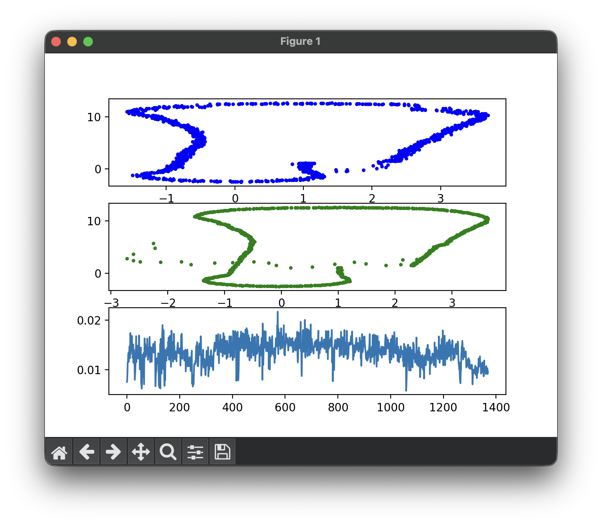
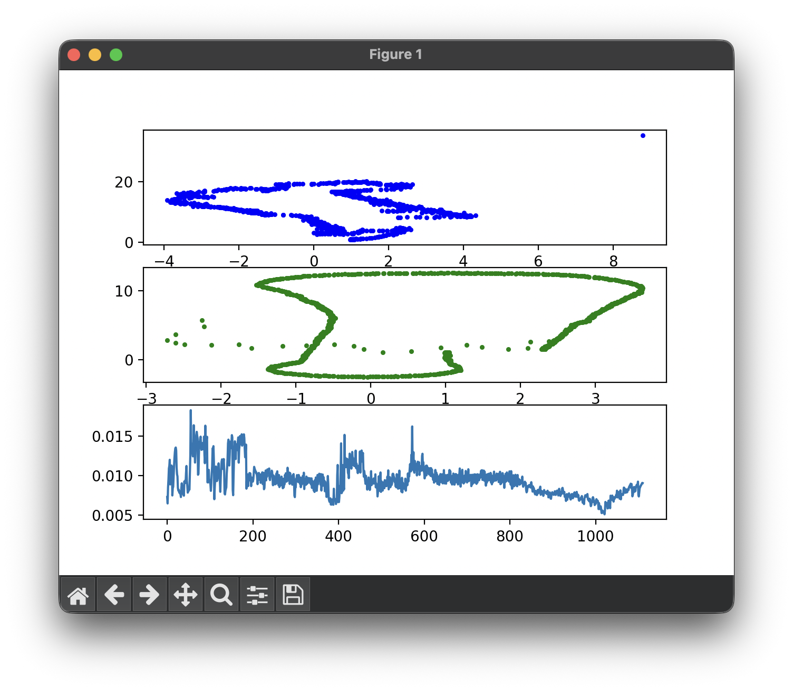
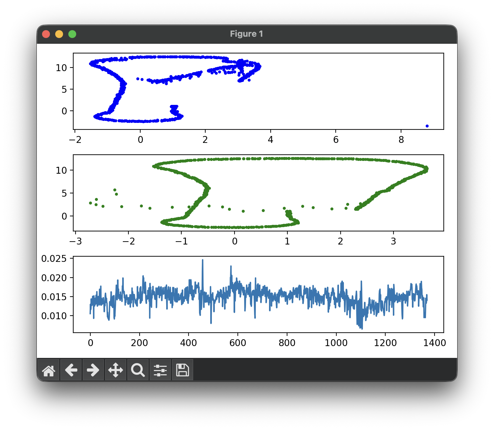

# Particle Filter Localization — Report

This report analyzes a Particle Filter implementation for localizing a forklift in a known map using 9 LiDAR reflectors. The filter runs on a recorded ROS bag and estimates the vehicle's 2D pose (x, y, θ).

Each scenario reports:

- Configuration (N particles, initialization mode, noise parameters)
- Estimated trajectory vs. Hipert reference (`pf_slam.txt`)

---

## Scenario 1: Guided Initialization , N = 200

### S1 - Configuration

| Parameter | Value |
| --- | --- |
| Initialization | GPS prior at (2, 1, -1) |
| N particles | 200 |
| σ_init (x, y, θ) | 0.5 m, 0.5 m, 0.1 rad |
| σ_pos (x, y, θ) | 0.05 m, 0.05 m, 0.05 rad |
| σ_landmark (x, y) | 0.4 m, 0.4 m |
| Data association | Nearest Neighbor |
| Resampling | Resampling wheel |

### S1 - Trajectory

The filter successfully tracks the forklift throughout the entire simulation (blue), closely matching the reference solution (green). A small cluster of outlier points appears near the center of the map, corresponding to frames where the best particle momentarily jumped to a nearby landmark due to ambiguous observations. The overall shape and scale of the path are consistent with the ground truth.

---

## Scenario 2 - Random Initialization, N = 200

### S2 - Configuration

| Parameter | Value |
| --- | --- |
| Initialization | Randomly uniform over map bounds |
| N particles | 200 |
| σ_init (x, y, θ) | 0.5 m, 0.5 m, 0.1 rad |
| σ_pos (x, y, θ) | 0.05 m, 0.05 m, 0.05 rad |
| σ_landmark (x, y) | 0.4 m, 0.4 m |
| Data association | Nearest Neighbor |
| Resampling | Resampling wheel |

### S2 - Trajectory

The filter fails to converge with 200 particles under random initialization. With ~500 m² of map area and only 200 particles, the expected particle density is ~0.4 particles/m², making it unlikely that any particle starts near the true vehicle pose (2, 1, −1). 

At the first `updateWeights` call, all particles receive near-zero weights; resampling then collapses the distribution onto whichever particles were least wrong by chance. The filter never recovers and produces a trajectory that bears no resemblance to the reference path.

The run also terminated earlier (~1100 frames vs ~1400 for guided init), suggesting that the filter loses all meaningful tracking ability before the bag finishes playing.

Increasing the particle number to 1000 in the same condition greatly improves the results, showing a trajectory similar to the reference one.
