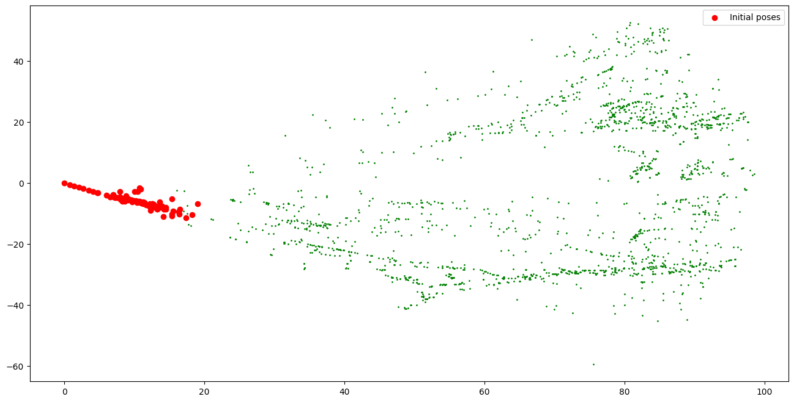
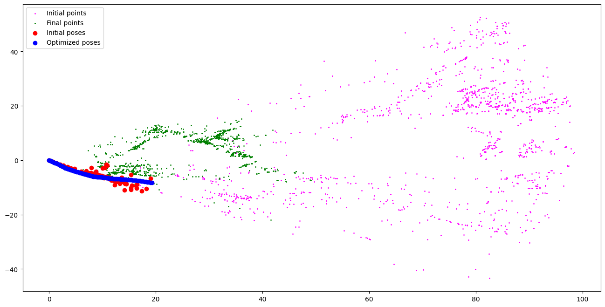
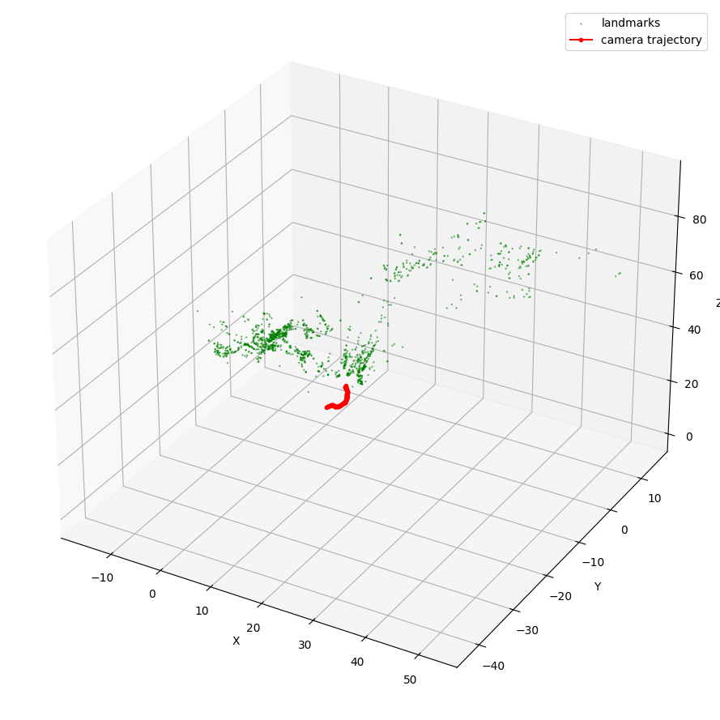

# Part 2 — Bundle Adjustment (bare-minimum)

Monocular Structure from Motion + offline Bundle Adjustment pipeline on the **EuRoC MAV MH_01_easy** dataset, implemented in [`ba_minimum.ipynb`](ba_minimum.ipynb).

Requirements covered by the bare-minimum:

- switch from KITTI (already rectified) to **distorted EuRoC**, with explicit undistortion
- **100-frame** sequence
- **re-triangulation** of new 3D points when the PnP inlier count drops below threshold

---

## 1. Setup

### Dataset

EuRoC MH_01_easy, `cam0` monocular, 20 Hz, 752×480, radial-tangential distortion.

- `images_path`: `./img/machine_hall/MH_01_easy/mav0/cam0/data/*.png`
- `START_FRAME = 1000`, `N_FRAMES = 100` (sequence with clean translational motion)
- `cam0` intrinsics (from `sensor.yaml`): `fx=458.654, fy=457.296, cx=367.215, cy=248.375`
- Distortion: `D = [-0.28340811, 0.07395907, 0.00019359, 1.76e-05]`

Each frame is loaded in grayscale and passed through `cv2.undistort(img, K, D)` before any further processing.

### Environment

Isolated `uv` project under `Part_2/` with Python 3.10 and the exact versions pinned by the course (`numpy==1.22.1`, `matplotlib==3.8.*`) — required for ABI compatibility with the `gtsam` pybind bindings.

---

## 2. Pipeline

### 2.1 Feature detection + tracking

- **FAST** (`threshold=25`, NMS) extracts keypoints at frame 0 and every time the tracked set drops below `min_features=2000`.
- **Pyramidal Lucas–Kanade** (`cv2.calcOpticalFlowPyrLK`) propagates points from one frame to the next.
- Every feature gets a **persistent unique ID** stored in `tracks_per_frame[k] = {id: (x, y)}`. This lets us recover inter-frame correspondences at arbitrary gaps without redoing any matching.

### 2.2 Monocular bootstrap (frame 0 ↔ k)

Adaptive search for the first pair `(0, k)` with enough motion:

- `cv2.findEssentialMat` with RANSAC on ID-indexed correspondences
- accept when `n_inliers ≥ 100` **and** `mean pixel disparity ≥ 5 px`
- on this config (`START_FRAME=1000`) the pair `(0, 1)` already passes (114 inliers, 15 px)

`cv2.recoverPose` decomposes `E` into `(R, t)` — `t` is unit-norm (monocular scale ambiguity). Inlier points are triangulated via `cv2.triangulatePoints(P1, P2, ...)` and filtered by `z > 0` and `||X|| < 100`.

### 2.3 Unified loop: PnP + re-triangulation

For every frame after the bootstrap:

1. Collect 2D–3D correspondences between the current map and the tracked points, then solve `cv2.solvePnPRansac` → pose `(R_k, t_k)`.
2. If `n_inliers < RETRIANGULATE_THRESHOLD (=150)` and the baseline w.r.t. the reference frame (`k − 5`) is ≥ `MIN_BASELINE (=0.05)`, **re-triangulate** the features shared between ref and curr that are not yet in the map.
3. New points must pass the same cheirality (`z > 0` in both views) and outlier (`||X|| < 100`) filters.

On the current run, re-triangulation at frames 2 and 8 grows the map from 114 → 1742 landmarks; from there PnP inliers stay well above threshold until the end.

### 2.4 Bundle Adjustment with GTSAM

- Variables: `Pose3` per camera (key `c_k`) and `Point3` per landmark (key `p_i`).
- `PriorFactorPose3` with σ = 1e-6 on the first camera pose to fix the gauge.
- `GenericProjectionFactorCal3_S2` reprojection factors with isotropic σ = 1 px noise, wrapped in a **Cauchy m-estimator** (c = 1.0) for robustness to residual outliers.
- Only landmarks with **≥ 3 observations** are inserted into the graph.
- Solver: **Levenberg–Marquardt** (`MULTIFRONTAL_CHOLESKY`, COLAMD ordering), max 100 iterations.

The current run converges in **49 iterations**.

---

## 3. Results

### Initial estimate (pre-BA)

Poses from bootstrap + chained PnP, points from initial triangulation + re-triangulations:

### Pre- vs post-BA

Side-by-side comparison: `Initial points` (magenta) and `Initial poses` (red) are the raw estimate; `Final points` (green) and `Optimized poses` (blue) are the post-BA result. Note how:

- the trajectory cleans up into a smooth arc,
- far-away outliers (magenta top-right) collapse into a much tighter cloud in front of the camera.

### Final 3D view

Camera trajectory (red) and optimized landmarks (green), rescaled by the same scale factor derived from the bootstrap:

### Summary numbers

| Metric | Value |
| --- | --- |
| Frames processed | 100 |
| Features tracked (peak) | ~2900 |
| Landmarks after re-triangulation | 1742 |
| Landmarks inserted in BA graph (≥3 obs.) | 1740 |
| Poses in graph | 100 |
| LM iterations to convergence | 49 |
