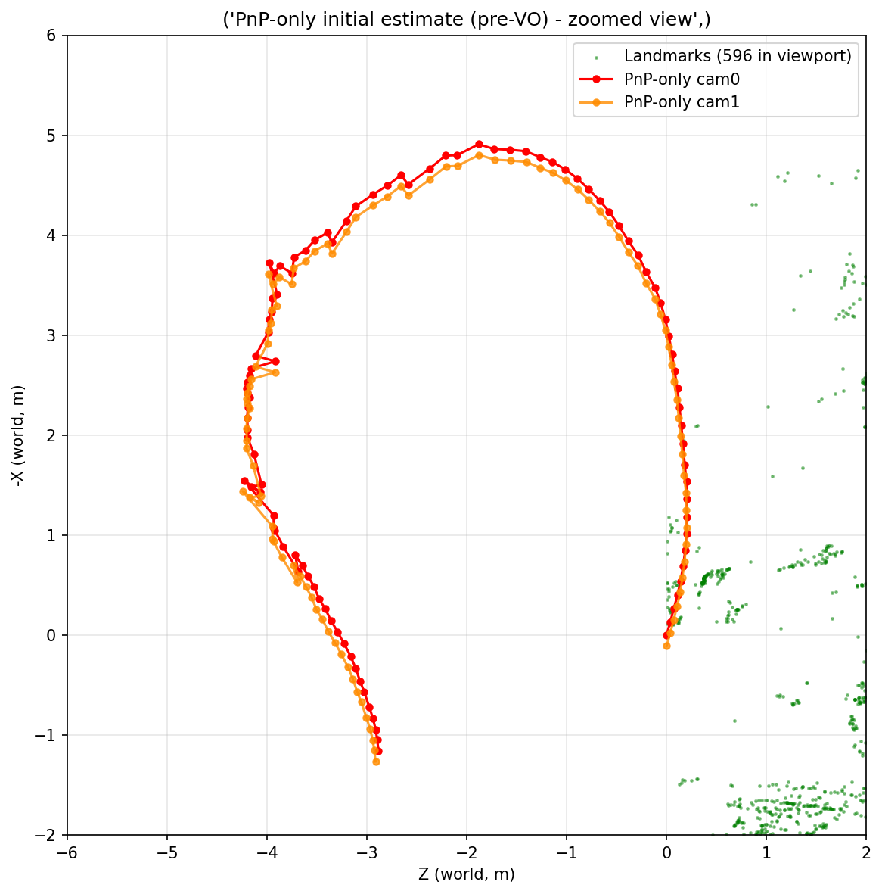
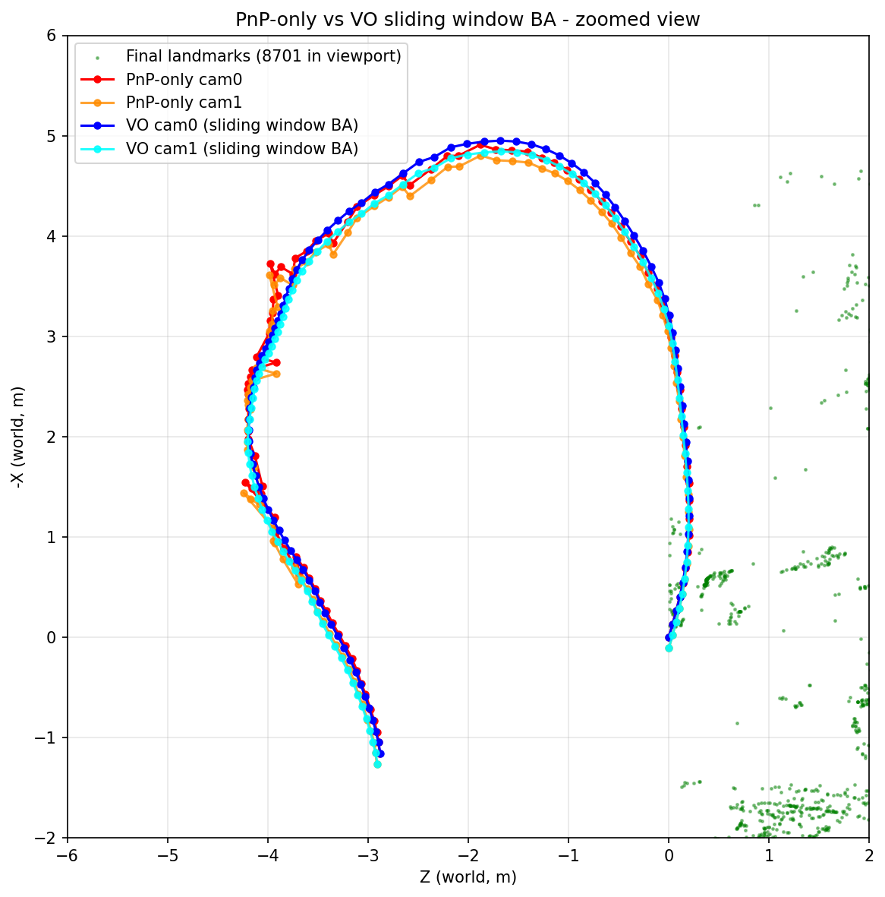
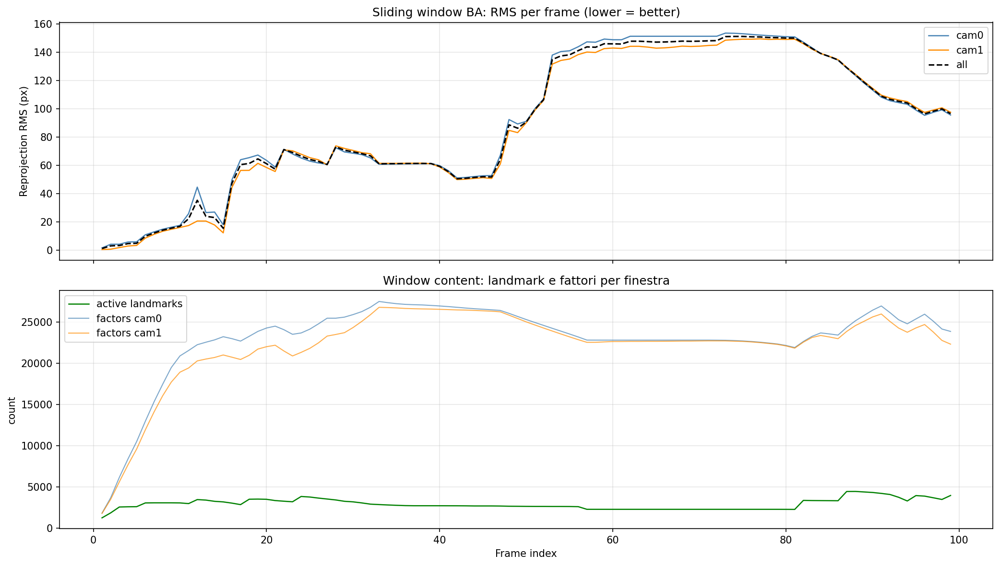
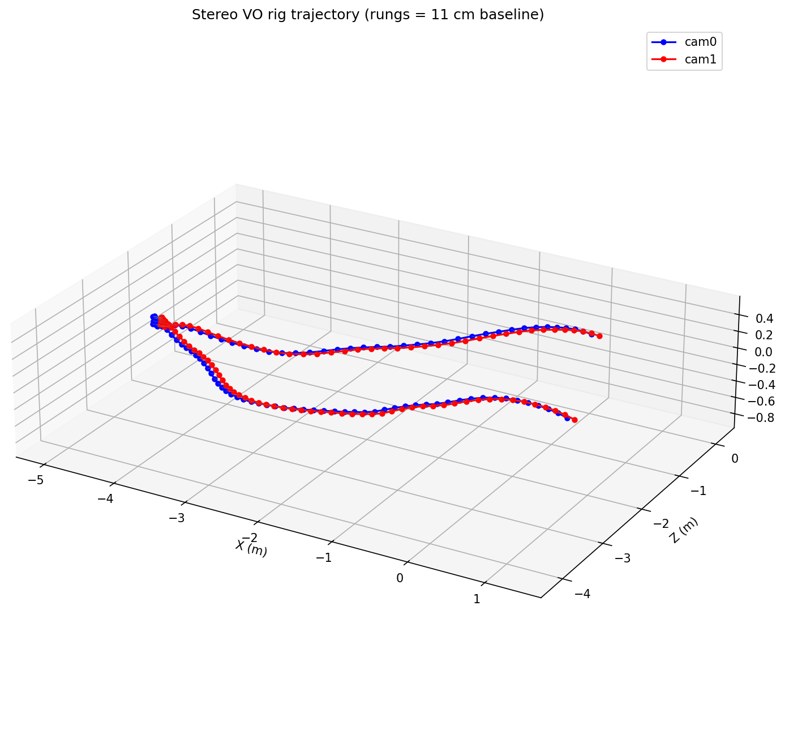

# Part 2 — Bundle Adjustment (advanced)

Stereo Visual Odometry with **sliding-window Bundle Adjustment** on the EuRoC MAV dataset,
implemented in [`ba_advanced.ipynb`](ba_advanced.ipynb).

The bare-minimum ([`ba_minimum.ipynb`](ba_minimum.ipynb), monocular) and medium
([`ba_medium.ipynb`](ba_medium.ipynb), batch stereo BA) are kept for reference; this README
documents only the **advanced** notebook.

## Requirements covered

Building on the bare-minimum (distorted EuRoC, 100 frames, re-triangulation), the advanced
notebook adds:

- **Medium point — stereo setup**: two cameras, points tracked both *in time* (cam0→cam0) and
  *across cameras* (cam0→cam1). All 2D observations from both cameras reconstruct the rig
  motion in a single factor graph.
- **Advanced point — Visual Odometry**: the batch BA is converted to VO. BA is solved only on a
  sliding window of the last `N` frames, ensuring continuity in the estimated poses via a strong
  prior on the oldest pose of each window.

---

## 1. Setup

### Dataset

EuRoC **MH_03_medium**, stereo pair `cam0`/`cam1`, 20 Hz, 752×480, radial-tangential distortion.
(`MH_05_difficult` was also tested — see [4](#4-robustness-mh_05_difficult))

- `START_FRAME = 1000`, `N_FRAMES = 100`, `STRIDE = 2` — one frame every two is processed,
  so the effective baseline between consecutive estimates is doubled. This amplifies the inter-frame
  motion and makes the BA refinement visible against the PnP-only baseline.
- `cam0` intrinsics: `fx=458.654, fy=457.296, cx=367.215, cy=248.375`
- `cam1` intrinsics: `fx=457.587, fy=456.134, cx=379.999, cy=255.238`
- Each frame is loaded grayscale and undistorted (`cv2.undistort`) before processing, so the rest
  of the pipeline can use the plain pinhole model.

### Stereo extrinsics

EuRoC provides the body→sensor poses `T_BS_cam0`, `T_BS_cam1`. The stereo extrinsic is derived by composing them (the body frame cancels):

```python
T_c0_c1 = inv(T_BS_cam0) @ T_BS_cam1   # convert cam1 coords -> cam0 coords
T_c1_c0 = inv(T_c0_c1)                 # convert cam0 coords -> cam1 coords
```

- `T_c0_c1` = pose of cam1 in cam0 frame (maps a point from cam1 to cam0) → used as GTSAM `body_P_sensor` (`sensor_pose_cam1`) for the cam1 factors.
- `T_c1_c0` = inverse → used to build the cam1 projection matrix for triangulation.

This gives a **baseline of 11.01 cm** with **0.818°** residual rotation. The known baseline is what
makes the whole reconstruction **metric** — no scale ambiguity, no essential-matrix bootstrap.

### Environment

Isolated `uv` project under `Part_2/`, Python 3.10, with the course-pinned versions
(`numpy==1.22.1`, `matplotlib==3.8.*`) for ABI compatibility with the `gtsam` pybind bindings.

---

## 2. Pipeline

### 2.1 Feature detection + tracking (front-end)

- **FAST** (`threshold=25`, NMS) extracts keypoints on cam0 at frame 0 and whenever the tracked
  set drops below `min_features=2000`.
- **Pyramidal Lucas–Kanade** propagates points two ways:
  - *temporal*: cam0 at frame `k-1` → cam0 at frame `k`;
  - *stereo*: cam0 at frame `k` → cam1 at frame `k`, with a **forward-backward check**
    (`FB_MAX_ERR=1 px`) that rejects matches whose round-trip drifts too far.
- Every feature carries a **persistent unique ID** shared across time and cameras, stored in
  `tracks_per_frame[k] = {"cam0": {id: (x,y)}, "cam1": {id: (x,y)}}`. cam1 never detects its own
  features — it only inherits cam0 IDs through the stereo match (~80% match rate).

### 2.2 Stereo init at frame 0

The first stereo pair is triangulated directly with `cv2.triangulatePoints`, using
`P0_init = K0·[I|0]` and `P1_init = K1·T_c1_c0[:3,:]`. cam0 at frame 0 is taken as the world origin.
Points are filtered by **cheirality** (`z > 0` in both cameras) and a 100 m depth cap.
No essential matrix, no scale ambiguity — the map is metric from the first frame.

### 2.3 Two parallel pipelines

To measure the BA contribution honestly, two pipelines share the same front-end
(`tracks_per_frame`) but differ only in the back-end:

| Pipeline | Map | BA |
| --- | --- | --- |
| **PnP-only** | `points_3d_map_pnp` (never touched by BA) | none |
| **VO** | `points_3d_map` (refined by BA each window) | sliding-window BA |

Without this split, a "pre-BA" snapshot would still run PnP on landmarks already refined by
previous BAs, biasing the comparison. With two independent maps, the gap between the trajectories
is exactly the refinement the BA produces.

### 2.4 Per-frame step: PnP + re-triangulation

For every frame, for each pipeline (`pnp_and_triangulate`):

1. **PnP** — collect 3D↔2D correspondences between the map and the cam0 observations, then
   `cv2.solvePnPRansac` (`SOLVEPNP_ITERATIVE`) → pose `(R_k, t_k)`. RANSAC rejects the LK outliers;
   the iterative refinement is LM on the inliers.
2. **Stereo re-triangulation** — for every ID that has a stereo match but is not yet in the map,
   triangulate with the freshly estimated pose. New points must pass cheirality, depth cap, **and**
   a reprojection check (`< 2 px` in both cameras) that guards against noisy PnP poses.

### 2.5 Sliding-window Bundle Adjustment (the advanced point)

Only the VO pipeline calls `run_window_ba(k)` after each frame:

- **States**: `Pose3` per frame in the window `c_k`, `Point3` per active landmark `p_i`.
- **Window**: the last `WINDOW_SIZE = 10` poses and all landmarks with `≥ MIN_OBS_IN_WINDOW = 2`
  observations inside the window.
- **Factors**: `GenericProjectionFactorCal3_S2` reprojection factors for every cam0 and cam1
  observation, σ = 1 px isotropic noise wrapped in a **Cauchy m-estimator** (`c = 1.0`) — robust to
  residual LK outliers (the cost grows logarithmically, IRLS-style).
- **Continuity / gauge**: a `PriorFactorPose3` with σ = 1e-6 pins the oldest pose of the window to
  the value it had in the previous window. This fixes the 6-DOF gauge freedom **and** stitches
  consecutive windows together.
- **Solver**: Levenberg–Marquardt, max `LM_MAX_ITER = 10` iterations (the initial guess is already
  refined by the previous window, so few iterations suffice). GTSAM uses its default sparse Cholesky
  factorization with COLAMD variable ordering, which exploits the same sparse block ("pickaxe")
  structure the Schur trick targets.

This is the *poor-man's* version of marginalization: the strong anchor prior replaces the proper
Schur-complement marginalization a full `IncrementalFixedLagSmoother`/`ISAM2` would do.

### Theory mapping

| Code | Course slide |
| --- | --- |
| `cv2.triangulatePoints` | Linear Point Triangulation (L3) |
| `z > 0` in both cameras | Cheirality check (L3) |
| `cv2.solvePnPRansac` | PnP (L3) + RANSAC (L3) |
| `cv2.Rodrigues` | Exponential map on SO(3) (L4) |
| Cauchy m-estimator | Robust NLLS kernel (L4) |
| `GenericProjectionFactor` + LM | BA = robust NLLS via Levenberg–Marquardt (L4/L5) |
| `Pose3` states / reprojection factors | Factor-graph optimization (L5) |
| sliding window + anchor prior | VO as a BA building block (L5) |

---

## 3. Results (MH_03_medium)

### PnP-only initial estimate

Trajectory from the greedy front-end (PnP frame-by-frame), before any windowed refinement:



### PnP-only vs VO

cam0/cam1 trajectories of the two pipelines overlaid. Red/orange = PnP-only, blue/cyan = VO. The
curves stay close where the scene is easy and separate where the PnP drift accumulates, which is
exactly what the windowed BA corrects:



### Reprojection RMS over time

Per-window reprojection RMS (cam0/cam1/total) and window content (active landmarks, factor counts):



The unwhitened RMS is high (median ≈ 90 px) because it squares the residuals and is dominated by
the LK outlier tail — the Cauchy kernel down-weights those during optimization, so the trajectory
still converges. RMS grows over time (open-loop drift) and drops after the large re-triangulation
events around frames 82–95.

### Final 3D view

Stereo rig trajectory with "rungs" between cam0 and cam1 at each pose, making the 11 cm baseline
explicit. Landmark clouds are exported as `.ply` under `plot/advanced/` for inspection in
MeshLab/CloudCompare:



### Summary numbers

| Metric | Value |
| --- | --- |
| Frames processed | 100 (stride 2) |
| Stereo match rate | ~80–90% |
| Landmarks @ stereo init (frame 0) | 550 |
| Landmarks in final map | 9144 |
| BA windows solved | 99 |
| Window size | 10 poses |
| Active landmarks / window (mean) | 2926 |
| Reprojection factors / window (mean) | ~45 300 |
| Reprojection RMS (mean / median / p95) | 90.8 / 90.6 / 150.4 px |

---

## 4. Robustness: MH_05_difficult

The same pipeline was run on `MH_05_difficult` (fast motion ~1.5 m/s, abrupt lighting changes).
The trajectory still converges over 100 frames; the reprojection RMS distribution differs:

| Metric | MH_03_medium | MH_05_difficult |
| --- | --- | --- |
| RMS mean | 90.8 px | 83.7 px |
| RMS median | 90.6 px | 72.5 px |
| RMS p95 | 150.4 px | 169.9 px |

MH_03 shows a roughly symmetric residual distribution (mean ≈ median, no dominant outlier tail) and
a clearly visible PnP-vs-VO trajectory gap — the BA has consistent, moderate error to refine across
all observations. MH_05 has a lower median but a much longer tail (mean > median, high p95): the fast
motion produces a few catastrophic LK outliers that the Cauchy kernel rejects, so the pose barely
drifts and the gap stays small. The two regimes illustrate that the PnP-vs-VO visual gap is not a
monotonic quality metric — it measures *how much* the BA must correct, not how good the result is.

---

## 5. Known limitations

- **No true marginalization** — the oldest window pose is fixed with a strong prior instead of being
  marginalized via the Schur complement, so correlations with the discarded history are dropped.
  A `gtsam.IncrementalFixedLagSmoother`/`ISAM2` would do this properly (and run faster).
- **Open-loop VO, no loop closure** — drift accumulates over time. Re-identifying previously seen
  places (place recognition + non-consecutive reprojection factors) would close loops and bound the
  global drift, turning the VO into full VSLAM.
