# Assignment 1 - Part 3

AY: 2025-2026

## Exercise 1 - Vehicle modeling and simulation

**Question**: What is the cause of the difference in the slip angle between
the linear and nonlinear models?

### Speed = 10m/s

By looking at the following plot you can notice that the tracjectory of all models at a limited speed is quite similar. 

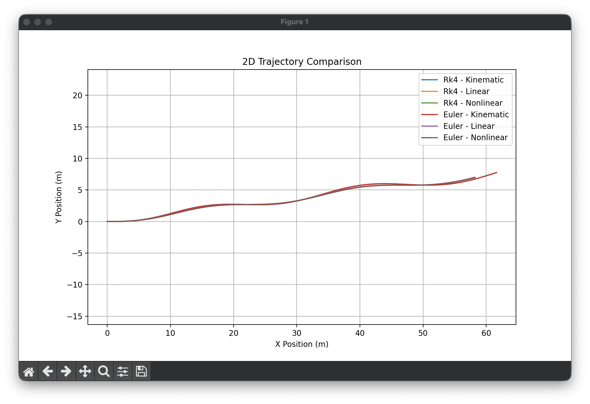

The slip angles graph also look all similar, with the non-linear model having a slightly higher slip angle than the linear one.
This because at low speeds the nonlinear effects are not limited, and the linear model can approximate the behavior of the vehicle reasonably well. The slip angle is primarily influenced by the lateral forces, which are not significantly affected by the nonlinearities at low speeds. Therefore, the difference in slip angle between the linear and nonlinear models is minimal at 10 m/s.

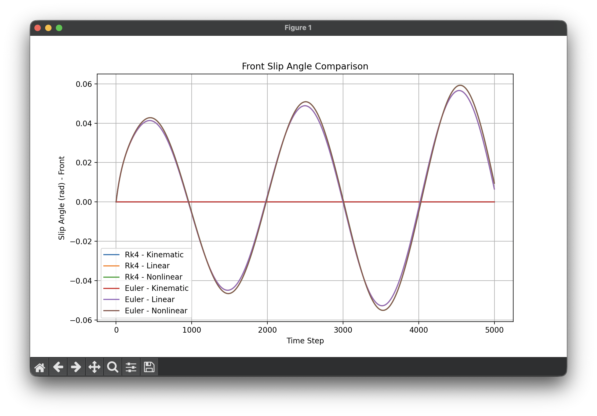

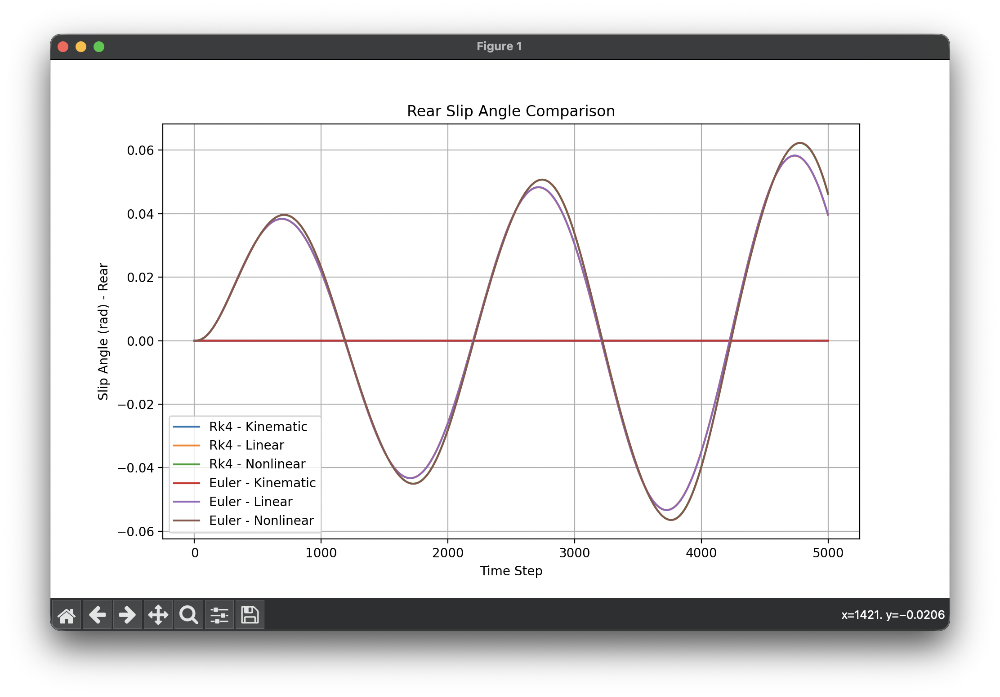

### Speed = 27m/s

At higher speeds, the trajectory of the nonlinear model starts to deviate more significantly from the linear model. 

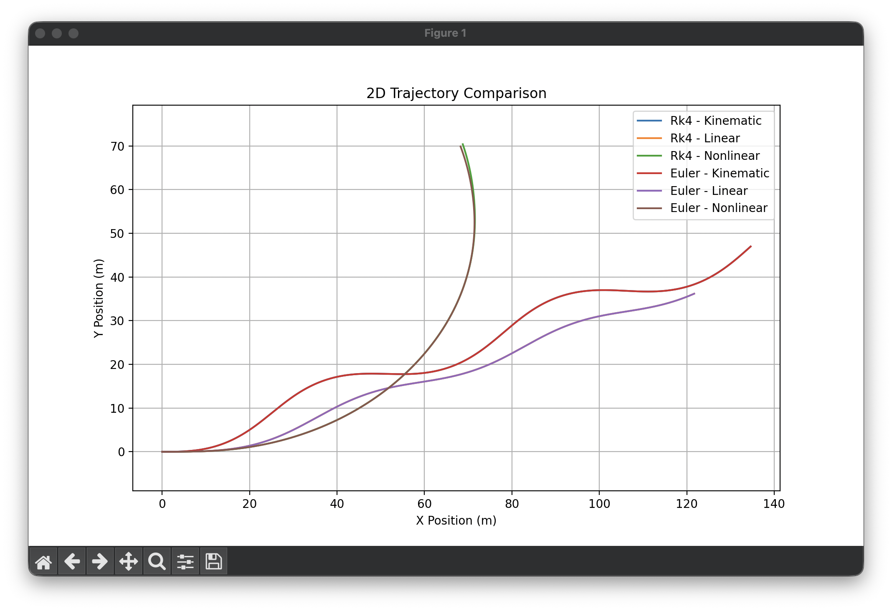

The slip angles in the nonlinear model are noticeably higher than in the linear one, due to higher lateral forces. You can also notice that the vehicle in the nonlinear model suffers from some slight oversteering effects, not presents in the linear model, when $\alpha_r > \alpha_f$.

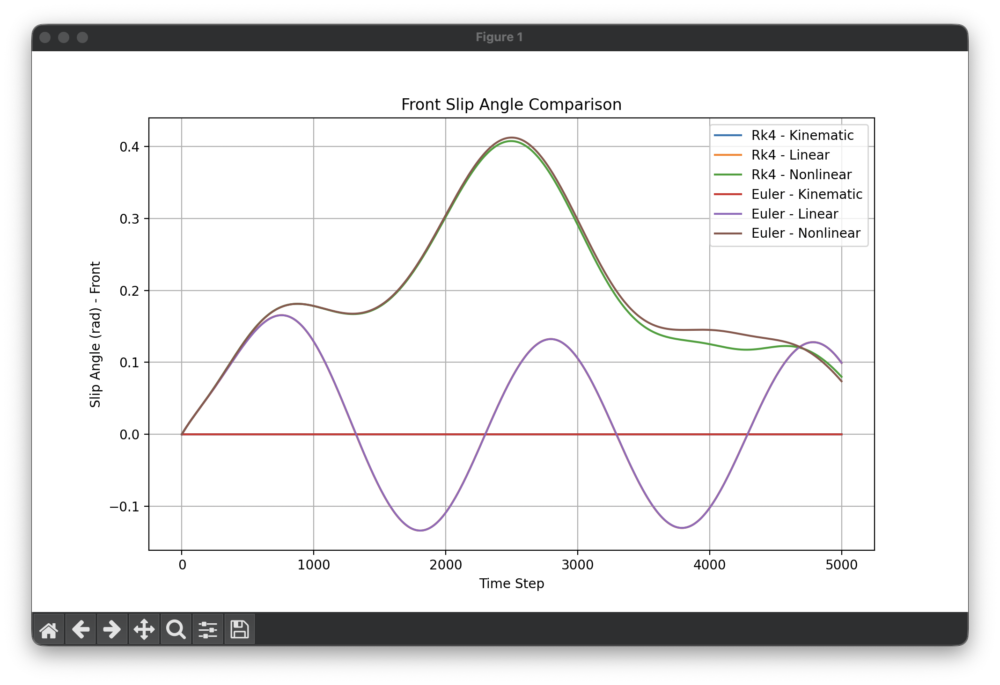

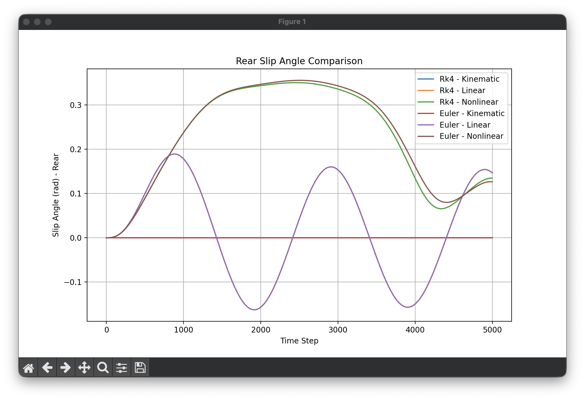

## Exercise 2 - Constant Steering and Acceleration

**Question**: Do you notice any significant differences between the trajectories or other data obtained from the different models? What is the main cause of the large difference observed in the second test, when the steer angle is increased to 0.055 rad?

### Steer = 0.01 rad

In a looser cornering scenario the trajectories of the different models are quite similar.

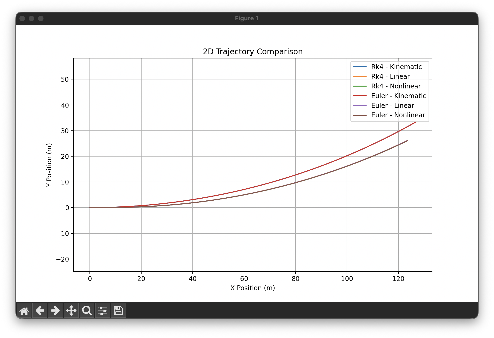

You can also notice that the slip angles are quite similar between the linear and nonlinear model.

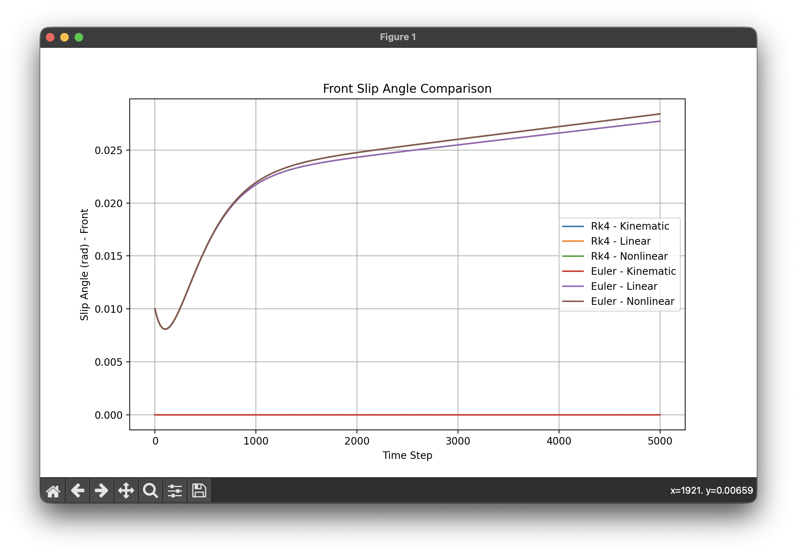
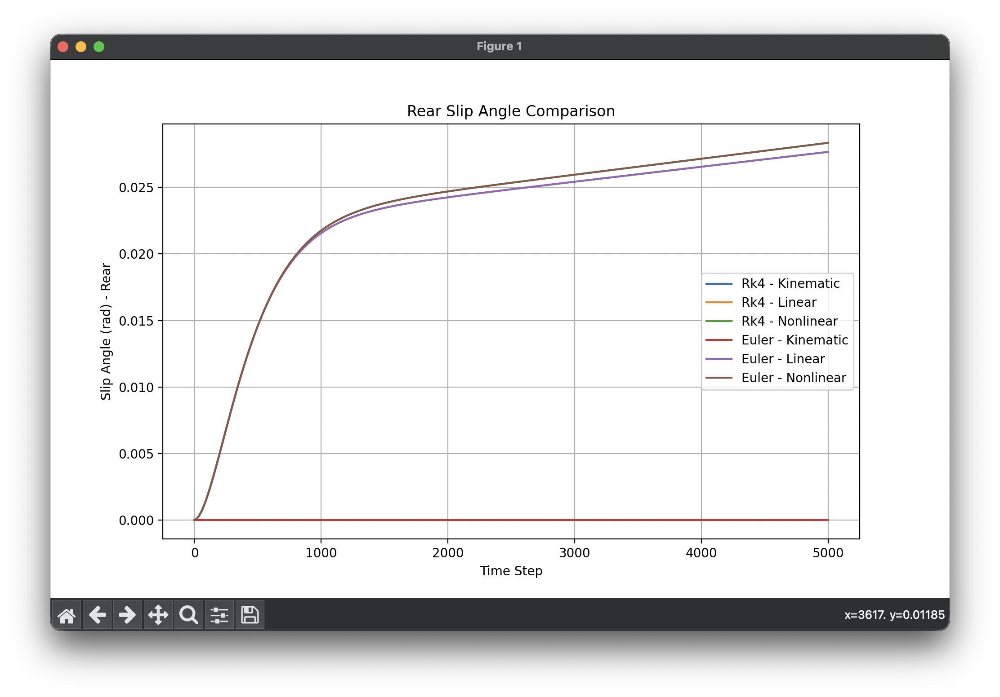

### Steer = 0.055 rad

In a tighter cornering case you can see the models behave quite differently.

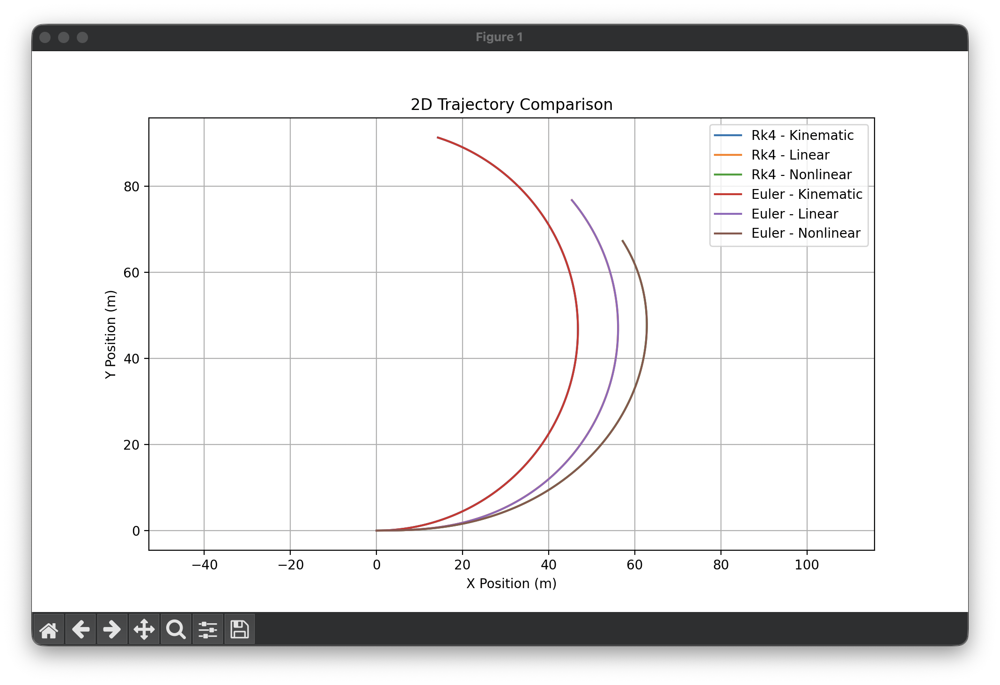

The kinetic model has the tightest curve since it doesn't take into account slip angles.
Linear and nonlinear models act differently due to the different slip angles formulae used, with the second one computing higher slip angles and not allowing a curve as tight as the linear one. 

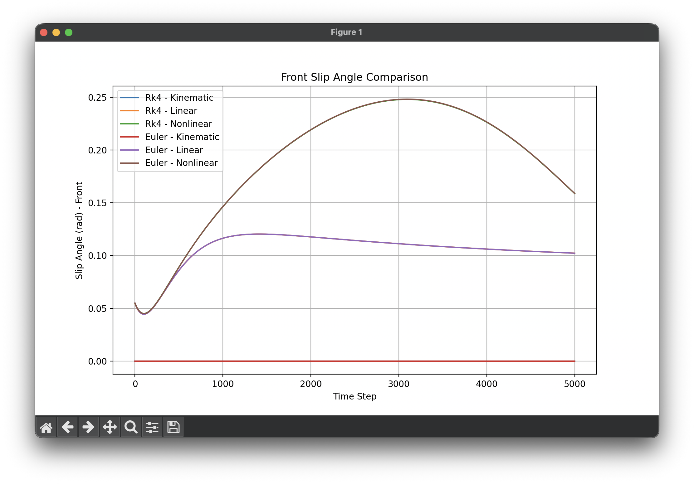
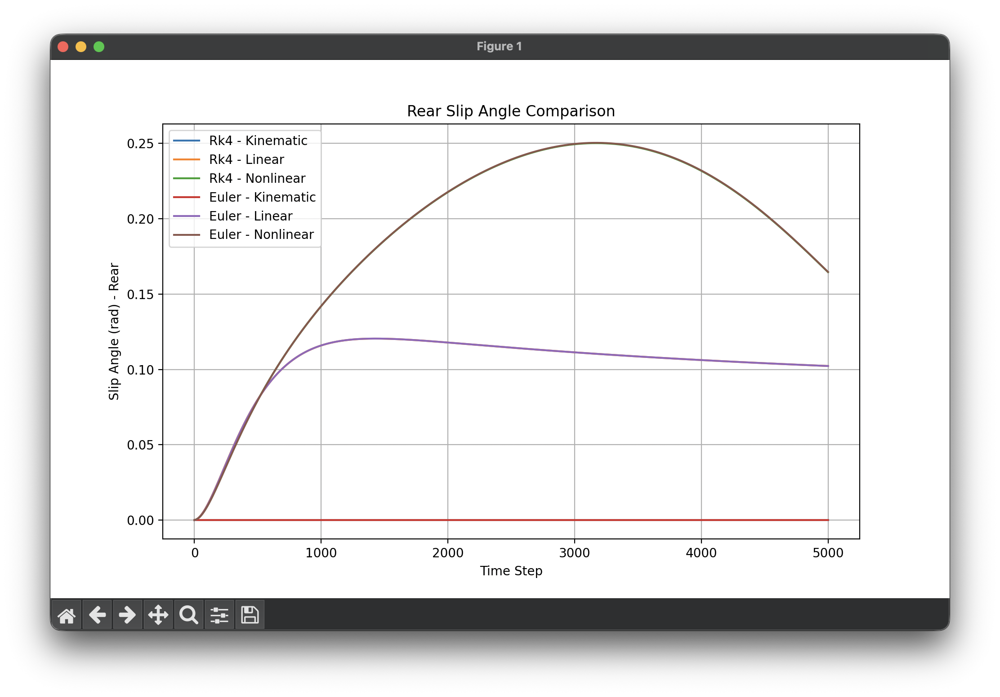

## Exercise 3: Comparing Numerical Integration Methods

**Question**: Why do you observe a visible difference in the simulation results when comparing Euler’s method and RK4 with a time step of 0.08 seconds?

### Time step = 0.08s

Increasing the time step from 0.01s to 0.08s causes difference mainly in the nonlinear model results when comparing Euler's method and RK4. 

While in the other examples trajectories overlapped here you can see how it deviates due to Euler's method computing next state just from the current one, which can lead to larger errors when using larger time steps. The RK4 method instead, being a fourth-order method, is more accurate since it uses a weighted average of four estimates of the derivative at different points in the interval. 

This causes the Euler method to produces a trajectory that deviates differently and more inaccuratly than the RK4 one.

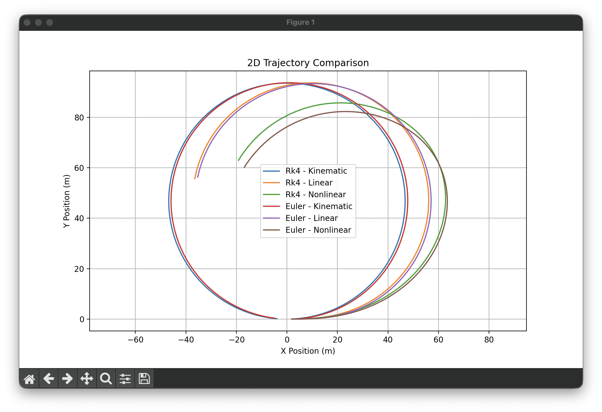
