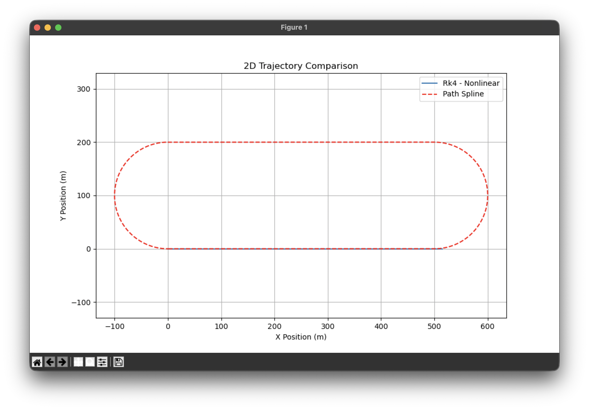
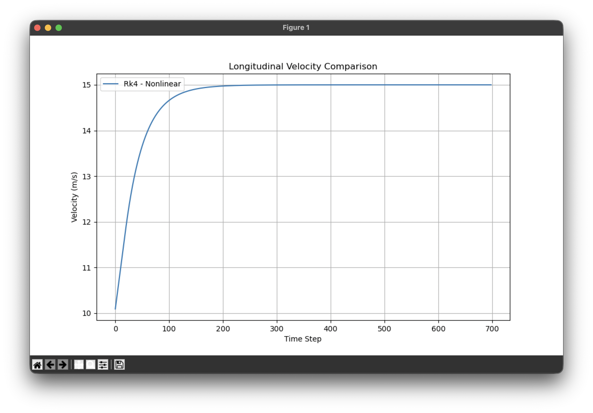
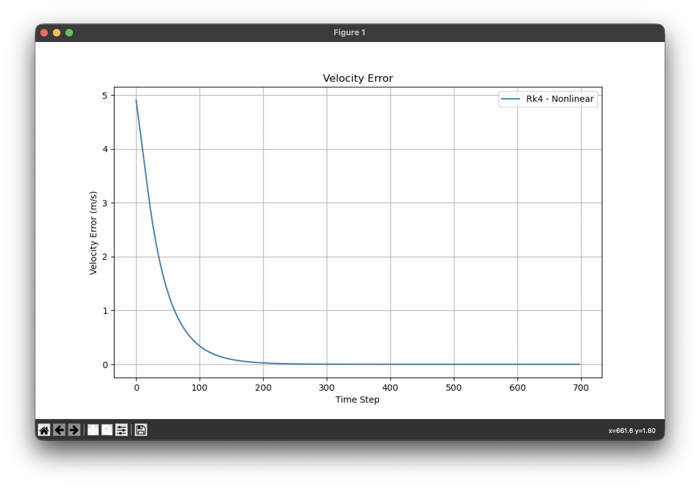
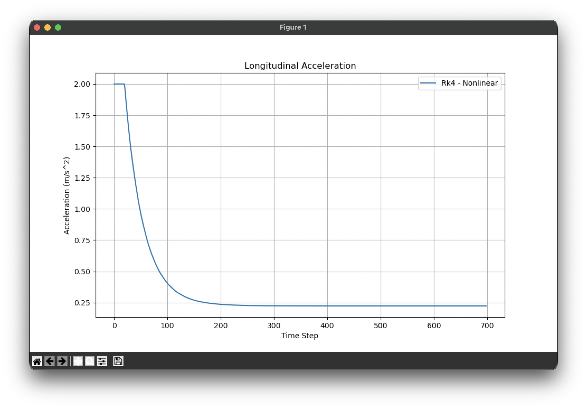
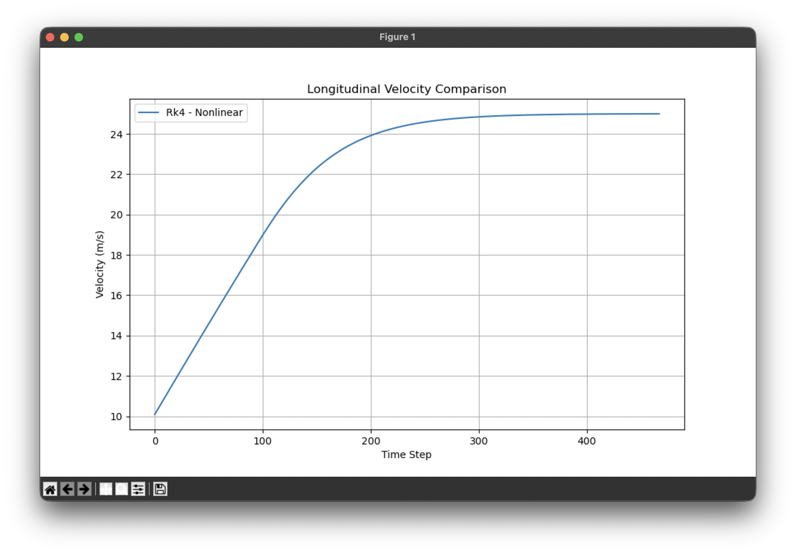
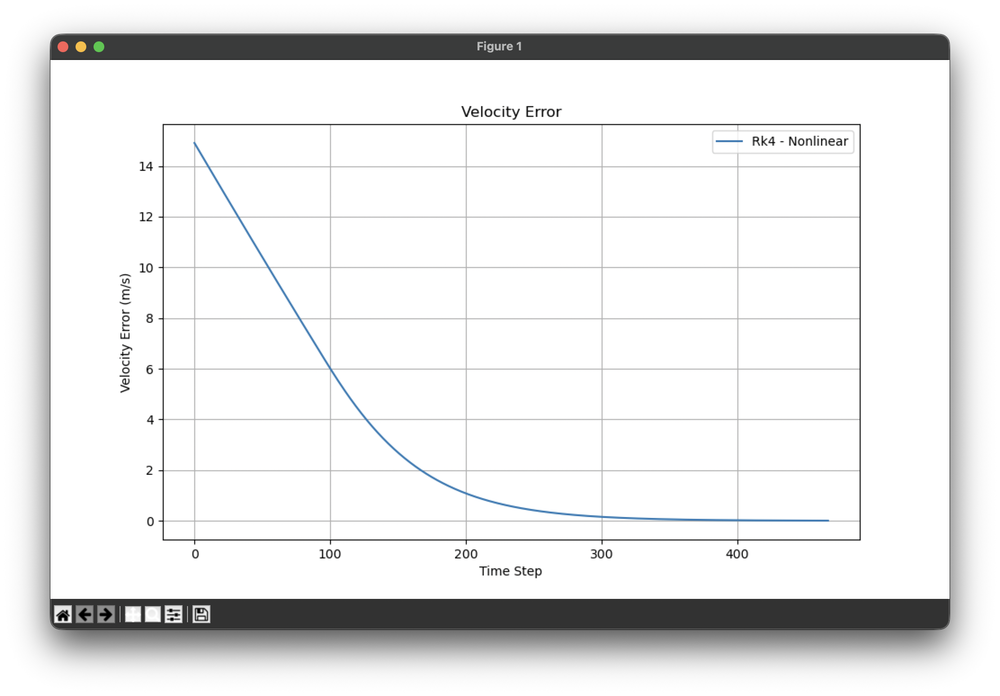
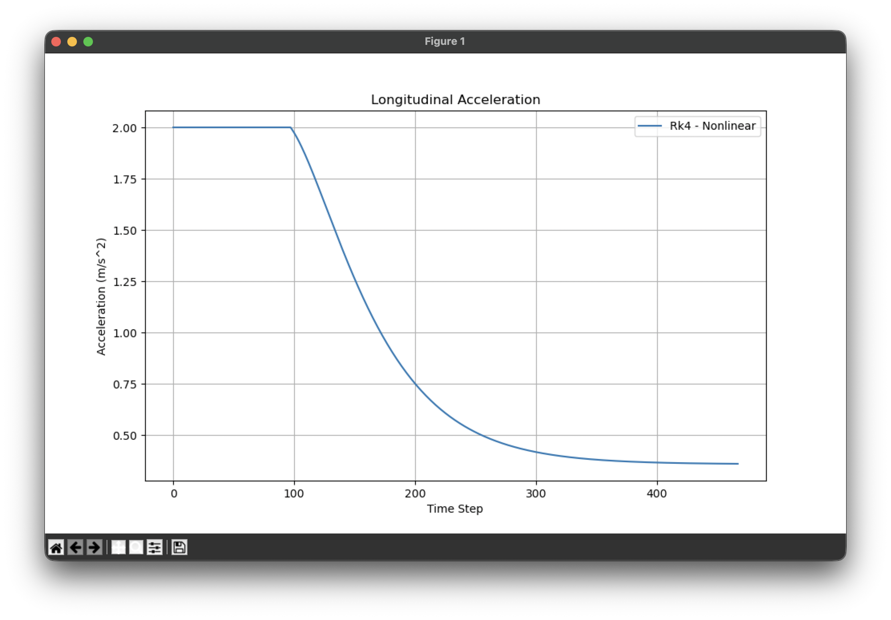

# Assignment 5

AY: 2025-2026

## Exercise 1 - Longitudinal Control

Plot the requested outputs for both velocity conditions and indicate what
are the settling time and eventually the overshoot, as well as other things
you could consider useful.



As you can see from the graph above in Ex.1 the vehicle is only capable of going straight since lateral control is disabled. The trajectory computed by the vehicle is of course the same for both testcases at 15 and 25m/s.

The PID gains were set for both test cases as follows after trial and error:

```python
kp=1, ki=0.25, kd=0.01
```

### Speed = 15m/s



At 15m/s you can notice how in the first 50 timesteps (2.5s) the vehicle reaches 14m/s and takes the next 150 (7.5s) timesteps to reach target speed slowly and controlled without overshooting. After 200 timesteps (10s) it settles at target speed and maintains it continuously.



You can see also how the initial velocity error starts at 5m/s until it converges to 0.



You can notice how the initial acceleration is constant at 2m/s^2 for the first ~20 timesteps and then decreases until reaching the minimum required to counter drag and rolling resistances (~0.23m/s^2).

### Speed = 25m/s



At 25m/s you can notice that target speed is reached after ~300 timesteps (15s) having a rapid increase for the first ~150 timestep (7,5s), then slower approaching the desired speed for the remaining ~150 timesteps (7.5s).



Velocity error starts at 15m/s and converges to 0 slightly after target speed is reached.



Acceleration is constant at 2m/s^2 for the first 100 timesteps (5s), and then slowly converging to the minimum required to maintain target speed after ~400 timesteps (20s).

## Exercise 2 - Low-speed Lateral Control

## Exercise 3: High-speed Lateral Control
