# Assignment 3 - Part 3

AY: 2025-2026

## Exercise 1 - Static obstacle avoidance at low speed

In this exercise the Frenet Optimal Trajectory planner is used to generate a collision-free path. The **Stanley controller** was used, since it generally has the best tradeoffs for low speed scenarios, such as the 10 m/s and 15 m/s required. Furthermore the implementation of assignment 2 was pretty precise so it's a more than suitable application. The longitudinal speed is controlled by the same PID from Assignment 2.

The initial template provided didn't actually check if the vehicle following the Frenet's spline was actually satisfying requirements, avoiding the obstacles by > 3.0m. One was implemented for testing.

Also a circe with `r = ROBOT_RADIUS` was added to each obstacle to check in the plot how actualy far from the obstacle the vehicle is.

### Frenet planner — collision check issue with default `DT = 0.2`

With the default sampling time `DT = 0.2 s`, consecutive points on each candidate path are spaced approximately `DT × vx = 0.2 × 10 = 2 m` apart. The collision check in `check_collision` compares only these sampled points against each obstacle; it does not verify the continuous arc between them.

As a result, a candidate path can pass through the 3 m obstacle radius without being detected if its closest point to the obstacle falls between two samples both located just outside the radius. This was confirmed by the trajectory plot at the first obstacle `(100, −0.5)`: the Frenet path and the vehicle both crossed inside the 3 m circle while the collision check reported no violation.

### Fix: parameter tuning

Two parameters were tuned together to resolve the collision check issue:

- **`DT = 0.05 s`** — reduces inter-sample spacing to ~0.5 m at 10 m/s, planner far more precise, but greatly increasing the computation cost for the simulation.

- **`D_ROAD_W = 0.8 m`**

### Speed = 10 m/s

The parameters specified above are able to allow the simulator at both speeds to complete the entire lap.

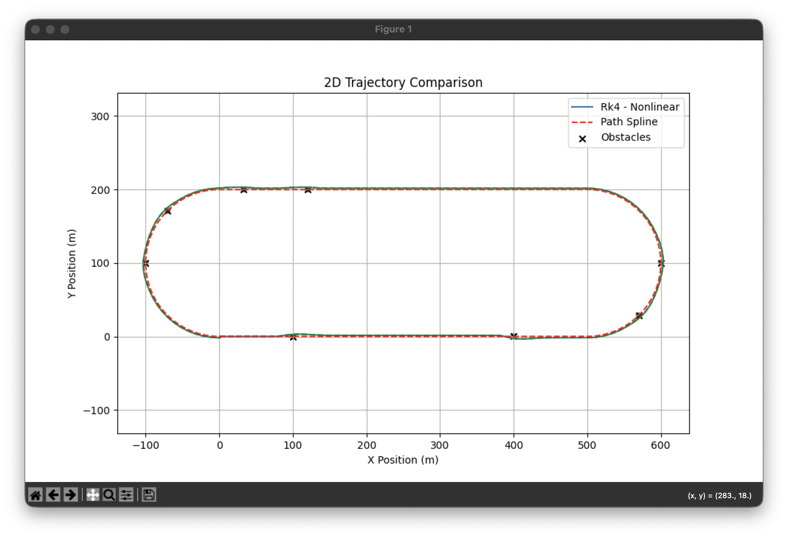

The vehicle completes the full lap avoiding all obstacles. The trajectory (blue) closely overlaps the Frenet path (green dashed), with visible deviations from the global spline (red) only in proximity of obstacles — as expected.

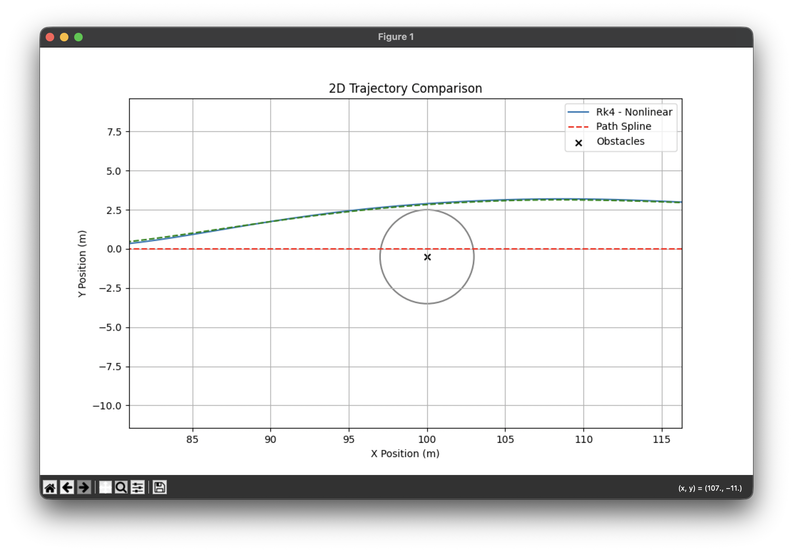
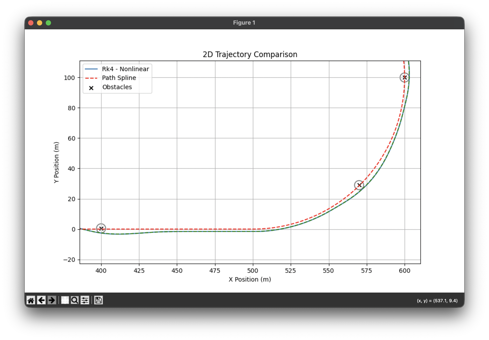
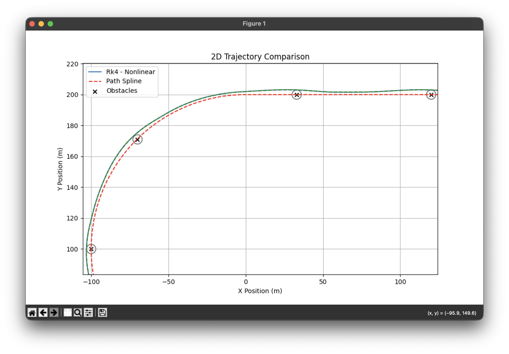

From these zoomed screenshots you can better asses the performance of the planner and controller.

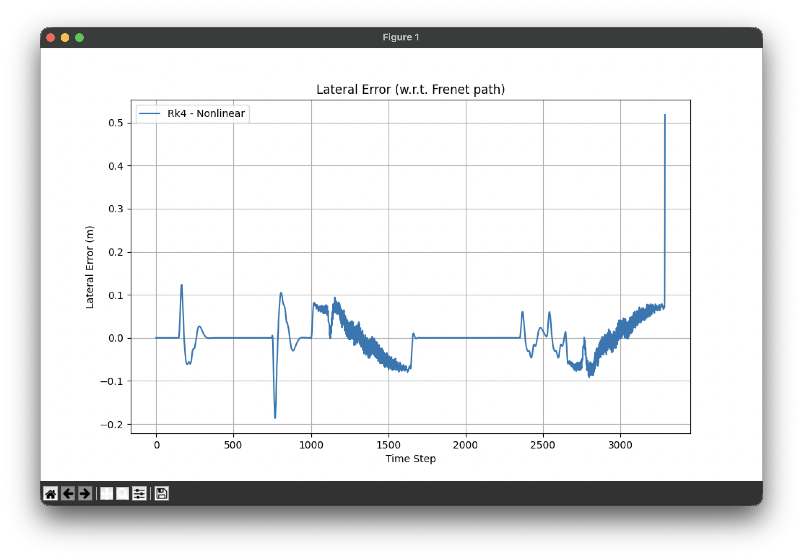

Lateral error w.r.t. the Frenet path peaks at ~0.20 m throughout the lap — consistent with Stanley's performance at 10 m/s from Assignment 2. The final spike is for the stopping check after completing a lap and should not be considered.

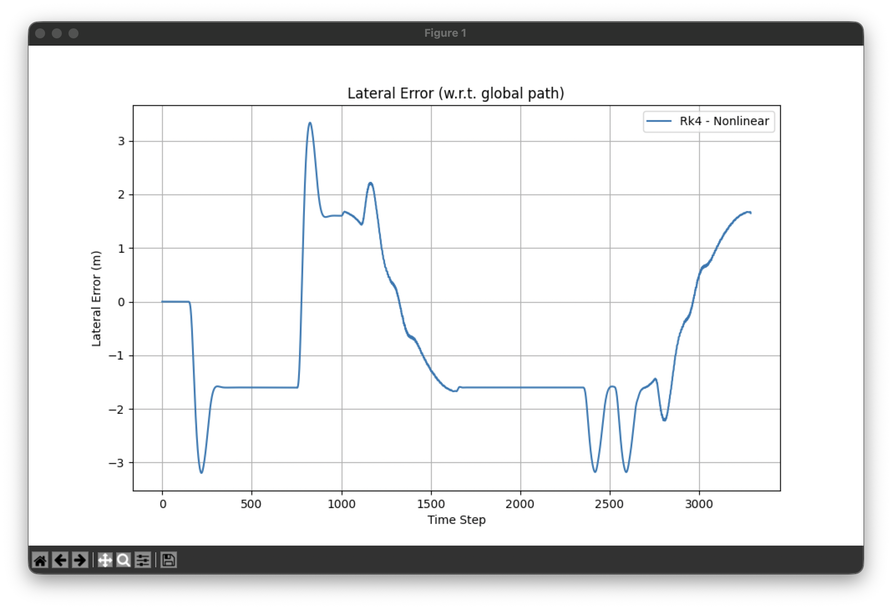

Lateral error w.r.t. the global path spline peaks at ~3.2 m during obstacle avoidance, within the 4 m safety limit. This deviation is caused by the Frenet path deviating from the centerline when avoiding obstacles.

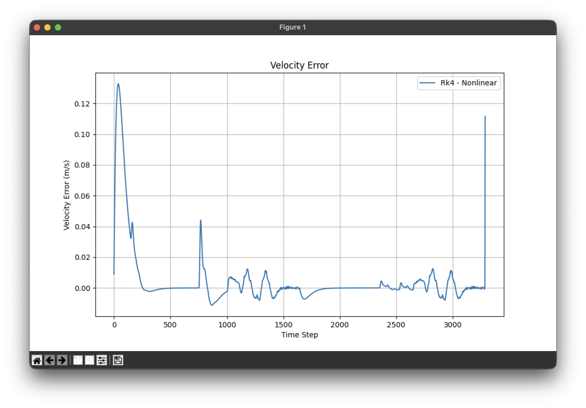

Peak velocity error is ~0.13 m/s (1.3% of target speed), well within the 5% requirement.

#### Execution time (10m/s)

The execution time of `frenet_optimal_planning()` was instrumented with `time.time()` around the call in the simulation loop and aggregated over the full lap. The same optimisation campaign was run at both 10 m/s and 15 m/s.

Configuration with only the collision-check fix applied (`DT = 0.05`, `D_ROAD_W = 0.9`) but default planning horizon and road width:

```text
Time: 163.9 s          # simulation time of the lap
[Frenet timing] steps: 3279 | avg: 199.58 ms | total: 654.43 s
paths after frenet calc: 240
```

Average planner cost: **199.58 ms/step**, roughly **4× the real-time budget** (`dt = 50 ms`).

```python
fp.MIN_T       = 2.8
fp.MAX_T       = 2.85
fp.D_ROAD_W       = 0.8
fp.MAX_ROAD_WIDTH = 4.0    # ±4m road width sufficient for this track
```

```text
Time: 165.05 s          # same lap, identical trajectory
[Frenet timing] steps: 3302 | avg: 20.56 ms | total: 67.87 s
paths after frenet calc: 40
```

A far better increase, maintaining the same performance as the original tracker, but reducing by ~1/10 the simulation time and the paths computed at each step from 240 to 40.

### 15 m/s

Same parameters were used as the 10m/s scenario both for the baseline and the speedup version.

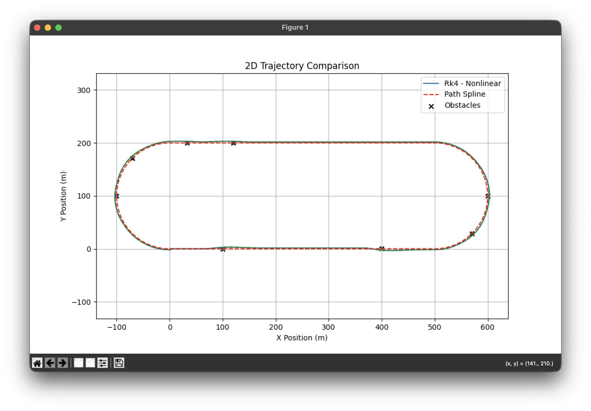

The vehicle completes the full lap avoiding all obstacles, same as the previous scenario.

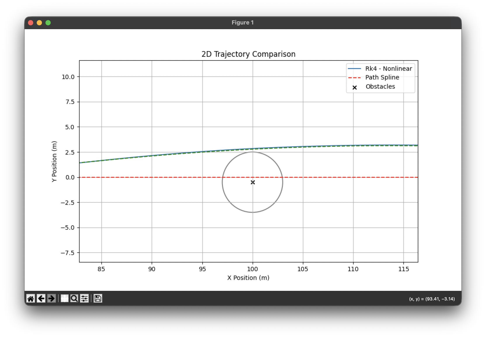
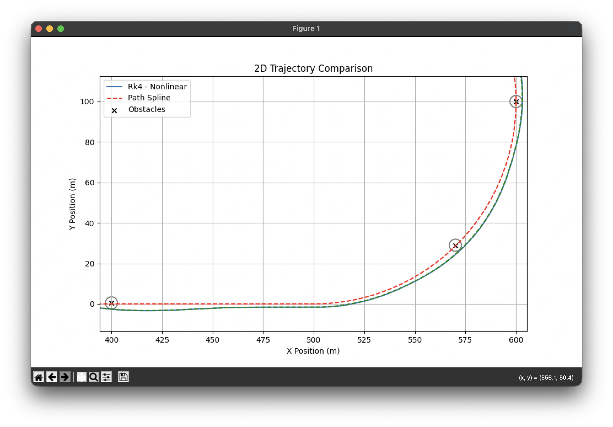
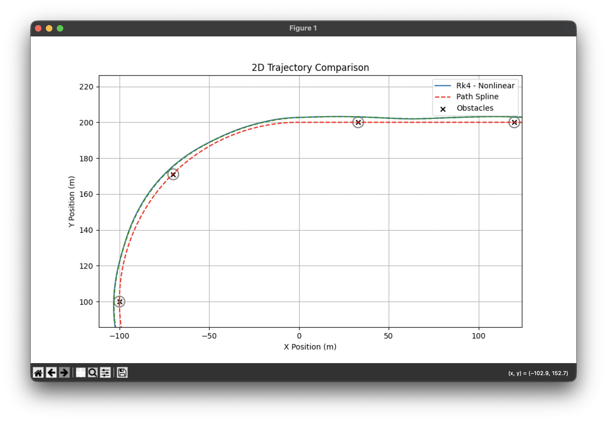

All the obstacles are avoided as required.

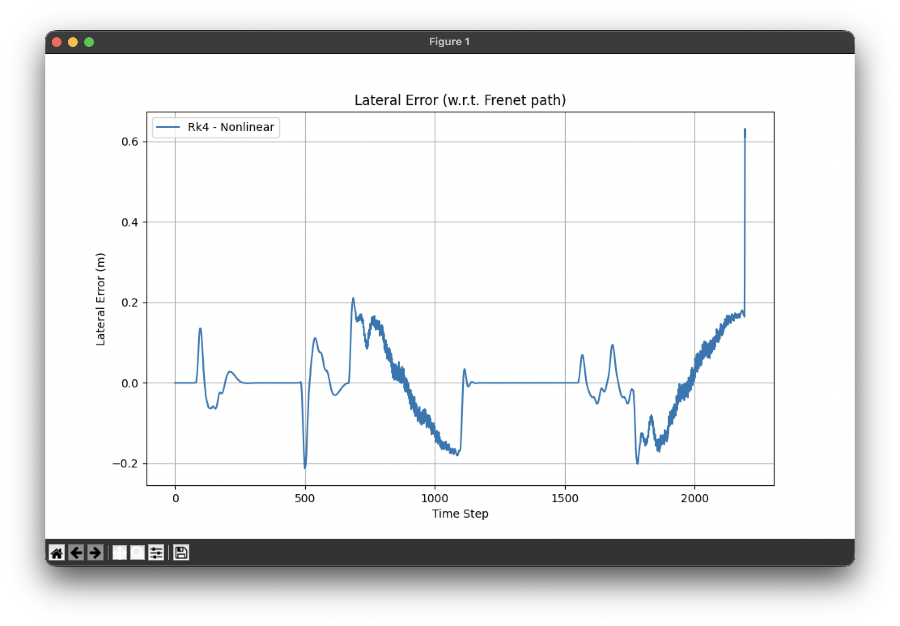

Lateral error w.r.t. the Frenet path peaks at ~0.20 m, as in the previous test case.

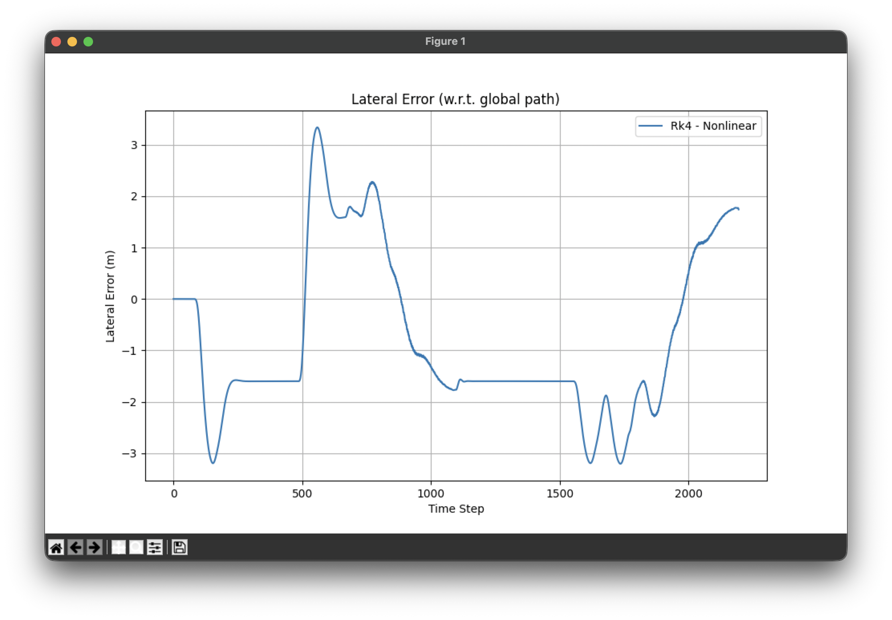

Lateral error w.r.t. the global path spline peaks at ~3.2 m, closely resembling the 10m/s scenario showing that the spline computend in both cases in practically the same.

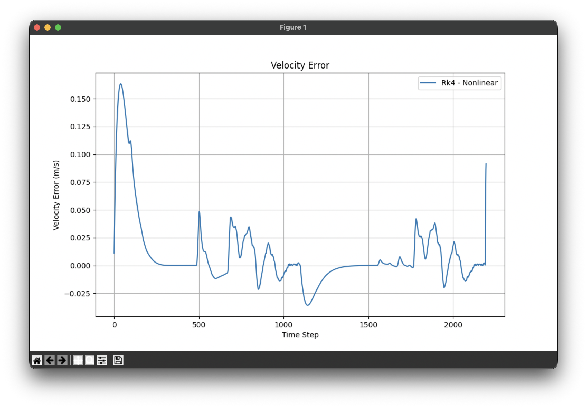

Peak velocity error is ~0.16 m/s, within the 5% requirement.

#### Execution time (15m/s)

Default planning horizon and road width (`MIN_T = 4.5`, `MAX_T = 5.0`, `MAX_ROAD_WIDTH = 5.0`):

```text
Time: 109.5 s
[Frenet timing] steps: 2191 | avg: 194.84 ms | total: 426.90 s
paths after frenet calc: 240
```

Average planner cost: **194.84 ms/step** — essentially identical to the 10 m/s baseline, as expected: the planner cost depends on the number of candidates and their length, not on the vehicle speed.

Same aggressive collapse applied at 10 m/s:

```python
fp.MIN_T       = 2.8
fp.MAX_T       = 2.85
fp.D_ROAD_W       = 0.8
fp.MAX_ROAD_WIDTH = 4.0  
```

```text
Time: 110.1 s
[Frenet timing] steps: 2203 | avg: 20.69 ms | total: 45.57 s
paths after frenet calc: 40
```

Same results as the 10m/s scenario, achieving a speedup of ~10x.
